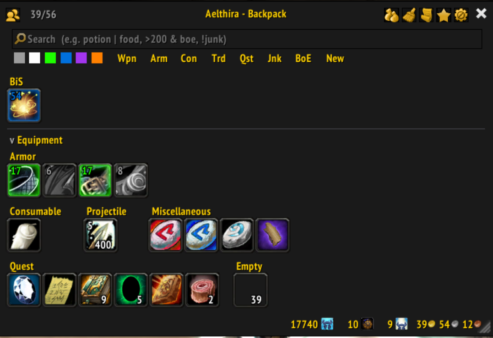
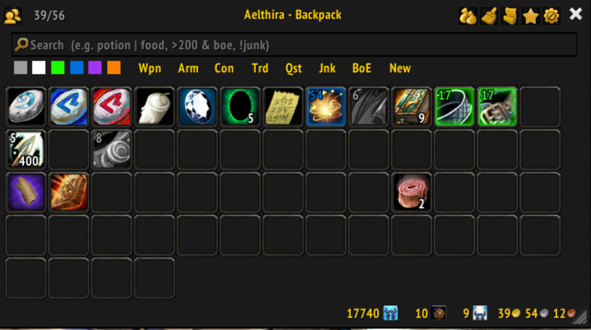
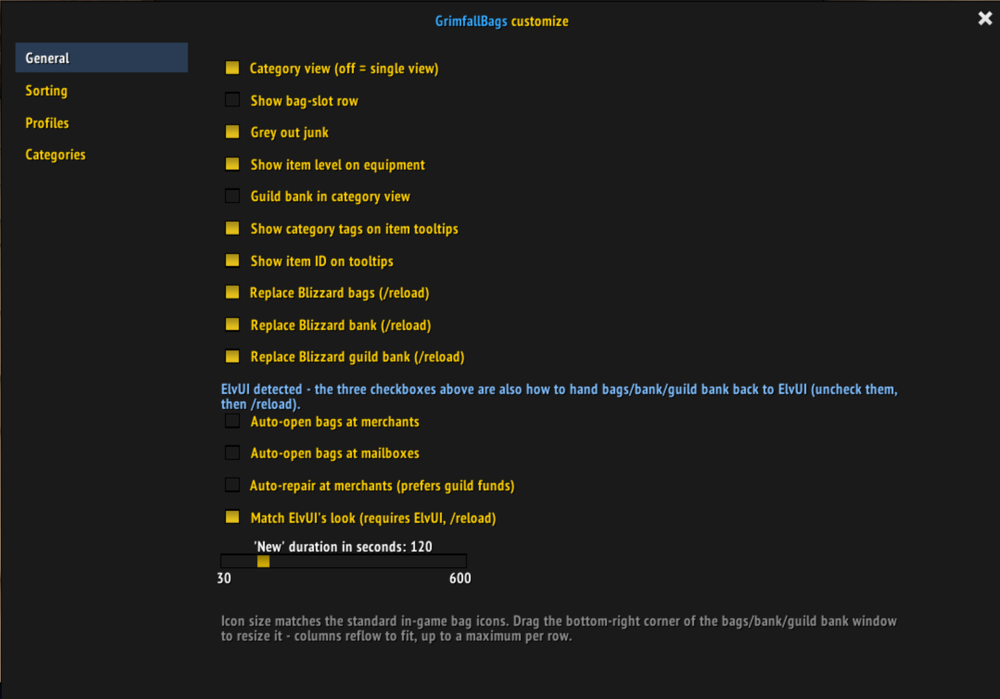
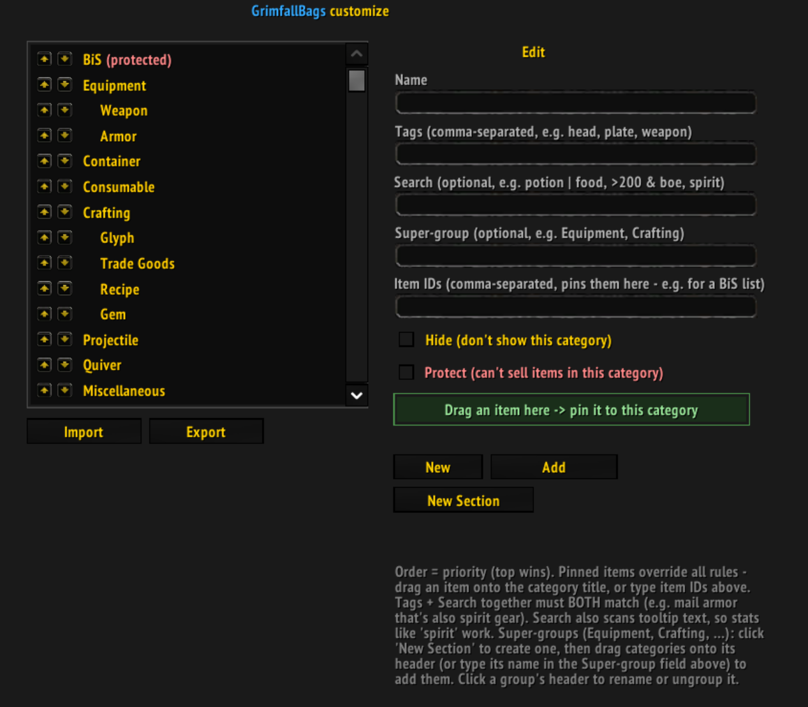
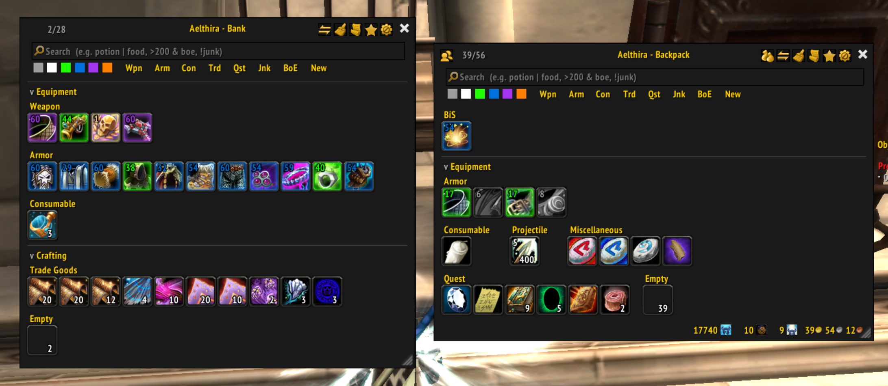
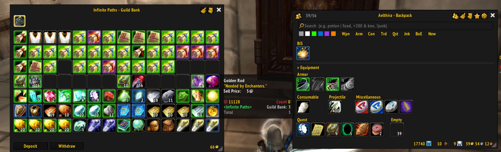
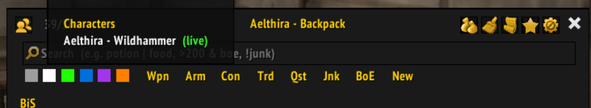

# GrimfallBags

A bag, bank, and guild bank replacement for **World of Warcraft 3.3.5a** on **Grimfall**, based on the retail addon [Baganator](https://www.curseforge.com/wow/addons/baganator) - there was never a 3.3.5a version, only retail, so this brings it to 3.3.5a and continues it with new features and fixes.

## Screenshots

<table>
<tr>
<td width="50%">

**Category view** (backpack)


</td>
<td width="50%">

**Single-list view** (backpack)


</td>
</tr>
<tr>
<td width="50%">

**Customize window - General**


</td>
<td width="50%">

**Customize window - Categories**


</td>
</tr>
<tr>
<td width="50%">

**Bank + backpack**


</td>
<td width="50%">

**Guild bank + backpack**


</td>
</tr>
</table>

**Viewing another character's bags/bank offline**, via Syndicator335's tracked data:



## Features

- **Category or single-list view**, with a flexbox-style flow layout that reflows to the window's width
- **Custom categories** - tag- and search-based rules, priority-ordered, with item pinning (e.g. for a "BiS" list) and sell-protection
- **Super-groups** - collapsible sections (like "Equipment" or "Crafting") that group categories together; create, rename, drag-to-group, or ungroup them from the editor
- **Search** - free text, quality words, item level comparisons/ranges, boolean operators, and a quick-filter row of quality swatches + item-type shortcuts (see [Search syntax](#search-syntax))
- **One-click sort**, asynchronous and loss-safe (merges partial stacks first, then swaps items into place one server-confirmed move at a time)
- **Context-aware transfer button** - sell junk/matching items at a merchant, deposit or withdraw matching items at the bank
- **Guild bank replacement**, with offline/remote viewing of tabs you've already scanned
- **View other characters' bags/bank offline**, via Syndicator335's tracked data
- **Tracked currency** shown inline with your gold
- **Automation** - auto-open bags at merchants/mailboxes, auto-repair (prefers guild funds)
- **Profiles** - save, apply, export/import, or share (via chat link) your display settings and full category setup
- **ElvUI integration** - detects ElvUI on login and asks which addon should own your bags/bank/guild bank, plus an optional skin that matches ElvUI's look
- Item level display and "New" item highlighting on item icons

Bulk transmog-appearance collection is present in the code but currently disabled (commented out, not deleted) - Grimfall doesn't have a transmog system yet. See [Notes for contributors](#notes-for-contributors).

## Branches

- `developer` (this branch) - full source with comments, where active work happens
- `main` - the default branch, a comment-stripped build kept in sync with `developer` at each release, tagged (`v1.2.0`, etc.) for every version

If you just want to install the addon, use `main` or a tagged release. This branch is for development.

## Requirements

- WoW client: 3.3.5a (`Interface: 30300`)
- **Syndicator335** (bundled in this repo) - the underlying data-tracking/search layer; GrimfallBags is a pure UI layer on top of it

## Installation

1. Copy both the `GrimfallBags` and `Syndicator335` folders into your `Interface/AddOns/` directory.
2. Fully restart the WoW client (see [Notes for contributors](#notes-for-contributors) - `/reload` alone is not always enough right after adding new files).
3. Enable both addons on the character-select AddOns screen.

## Usage

| Command | Effect |
|---|---|
| `/gfbags`, `/gbags`, `/GrimfallBags` | Toggle the bag window |
| `/gfbags options` | Open the customize window |
| `/gfbags log` | Print the internal error log |
| `/gfbags clearlog` | Clear the internal error log |

## Configuration

Open the customize window from the gear icon in the bag window's title bar, or via `/gfbags options`:

- **General** - view mode, item level display, tooltip options, Blizzard-frame replacement toggles (bags/bank/guild bank), automation (auto-open/auto-repair), ElvUI skin toggle
- **Sorting** - sort method: type, quality, or item level
- **Profiles** - save/apply/delete/export/import/share display settings + categories
- **Categories** - the category editor

## Categories

Each category is a rule with:

- **Tags** - matches an item's type/subtype/equip-slot (shown on tooltips if enabled)
- **Search** - an optional query in the same syntax as the search box; if both tags and a search are set, an item must match **both**
- **Super-group** - an optional section name; categories sharing one render together under a collapsible header, both in the editor and in the actual bag window
- **Item IDs** - pins specific items to this category, overriding tags/search (drag an item onto the category, or drag one category onto another's header to group them)
- **Hide** / **Protect** - hide the category, or block selling from it

Priority (top of the list wins) determines match order and is independent of section grouping - a section's effective position is wherever its first (highest-priority) member sits.

## Search syntax

| Pattern | Meaning |
|---|---|
| `potion` | free text - matches name, type, subtype, or tooltip text |
| `potion \| food` | either matches |
| `mail & spirit` | both must match |
| `!junk` | must not match |
| `(a \| b) & c` | parentheses |
| `>200` / `<100` / `=150` | item level comparison |
| `200-210` | item level range |
| `epic`, `rare`, `poor`, ... | quality words |
| `boe`, `bop`/`soulbound`, `bou`, `junk`, `new`, `equipment` | keywords |
| `weapon`, `armor`, `trade goods`, `quest`, `gem`, ... | item-type keywords (localized) |

## Project structure

- `GrimfallBags/` - the addon: UI, categories, sorting, transfers, guild bank, ElvUI skin
  - `Core.lua` - bootstrap: shared table, logging, config/defaults, slash command
  - `WindowChrome.lua` - window styling, move/resize/position persistence, icon buttons
  - `ElvUISkin.lua` - optional ElvUI look-and-feel integration
  - `IOWindow.lua` - shared import/export popup
  - `Profiles.lua` - profile save/apply/export/import/chat-link sharing
  - `Json.lua` - minimal JSON encode/decode (profile/category export format)
  - `Categories.lua` - category rules, the category editor, tag/section logic
  - `Views.lua` - bag/bank windows: layout, search, toolbar, currency, transmog
  - `GuildBank.lua` - guild bank window
  - `Sorting.lua` - async in-place bag sort
  - `Transfers.lua` - merchant/bank transfer + category sell
  - `Options.lua` - the customize window (tabs + sidebar)
  - `Assets/` - custom icons and window-skin textures
- `Syndicator335/` - data layer: bag/bank/mail/currency tracking, search engine
- `tools/build_release.py` - generates a comment-stripped copy in `dist/` for releases (see below)

## Building a release

Source files keep their comments for development on this branch. To cut a release onto
`main`:

```bash
python tools/build_release.py
```

This writes a full copy of `GrimfallBags/` and `Syndicator335/` into `dist/`, with Lua
comments removed (both whole-line and inline trailing comments) and everything else
(`.toc`, `Assets/`) copied unchanged. Your working source is never modified. `dist/` is
git-ignored - regenerate it whenever you cut a release.

Then check out `main`, copy `dist/GrimfallBags/` and `dist/Syndicator335/` over the
existing folders, bump the version in `GrimfallBags.toc` and `Core.lua`, commit, and tag
the commit (e.g. `git tag v1.2.1`). Push both the commit and the tag, then create a
GitHub Release from that tag.

Note: the stripper bails out and copies a file as-is (with a warning) if it contains a
`[[` long-bracket string or block comment, rather than risk mishandling one. `Views.lua`
currently has a `--[[ ]]` block comment (the disabled transmog button) and will ship
un-stripped in `dist/` as a result - still valid, just not comment-free like the rest.

## Notes for contributors

- **This Grimfall client build does not reliably pick up a brand-new `.lua` file added to an already-loaded addon via `/reload`.** If you add a file and list it in the `.toc`, do a full client restart (exit to desktop and relaunch, or at minimum log out to the character-select screen) - otherwise you'll see "attempt to call a nil value" errors for anything defined only in the new file. Edits to *existing* files reload fine.
- **Texture paths are literal filesystem paths**, not resolved through the addon manager - `Interface\AddOns\<folder>\...` has to match the real on-disk layout under the client root exactly. This tripped us up because `RequiredDeps: Syndicator335` in the `.toc` resolves fine as a bare name (that goes through addon-metadata resolution), but a texture at the same nominal depth does not.
- `Assets/Currency.tga`, `Guild.tga`, `GuildTabLogs.tga`, `GuildTabText.tga`, `Chest.tga`, `Everything.tga`, `logo.tga`, `bag_keys.tga`, `bag_soul_shard.tga`, `classic-bag-slot.tga`, `equipment-set-shield.tga`, and `arrow.tga` are provided but currently unused - reserved for features not yet wired up (e.g. a keyring/soul-shard bag icon, a protected-item shield indicator, section-header collapse arrows).
